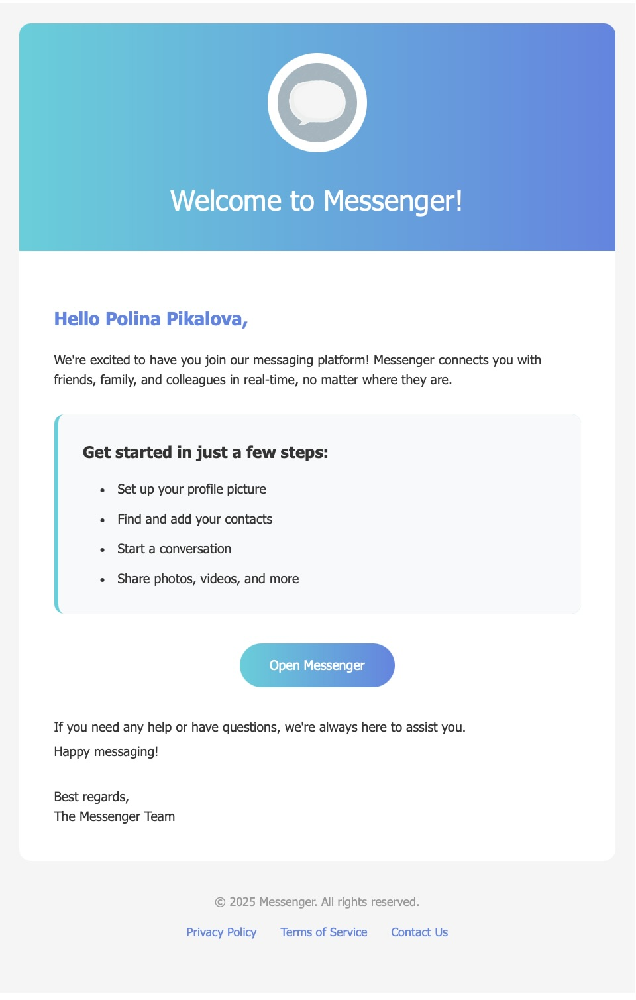

# Chatify-App

A modern, real-time messaging application built with the MERN stack and Socket.io, featuring secure authentication, image sharing, and a responsive dark theme interface.

**Live Demo**: [Try it out!](https://chatify-messenger-16yi1.sevalla.app/login)

## 🚀 Features

- **Real-time Messaging**: Instant message delivery using Socket.io
- **User Authentication**: Secure signup/login with JWT tokens
- **Image Sharing**: Upload and share images in conversations
- **User Profiles**: Custom avatars and profile management
- **Contact Management**: View all users and manage conversations
- **Responsive Design**: Mobile-friendly dark theme UI
- **Security**: Password encryption, rate limiting, and input validation
- **Email Notifications**: Welcome emails for new users 

## 🛠️ Tech Stack

### Backend

- **Runtime**: Node.js (ES Modules)
- **Framework**: Express.js
- **Database**: MongoDB with Mongoose ODM
- **Real-time**: Socket.io
- **Authentication**: JSON Web Tokens (JWT) + bcrypt
- **File Storage**: Cloudinary
- **Email Service**: Resend
- **Security**: Arcjet middleware

### Frontend

- **Framework**: React 19
- **Build Tool**: Vite
- **Styling**: Tailwind CSS + DaisyUI
- **State Management**: Zustand
- **Routing**: React Router v7
- **HTTP Client**: Axios
- **Real-time Client**: Socket.io-client
- **Icons**: Lucide React
- **Notifications**: React Hot Toast

## 📋 Prerequisites

- Node.js (v20 or higher)
- MongoDB database
- Cloudinary account (for image uploads)
- Resend account (for email notifications)

## 🔧 Installation

1. **Clone the repository**

   ```bash
   git clone https://github.com/Poly1999/Chatify---Messenger.git
   cd chatify-app
   ```

2. **Install dependencies**

   ```bash
   npm install
   ```

   This command installs dependencies for both backend and frontend.

3. **Environment Setup**

   Create a `.env` file in the `backend` directory:

   ```env
   MONGO_URI=your_mongodb_connection_string
   JWT_SECRET=your_jwt_secret_key
   CLOUDINARY_CLOUD_NAME=your_cloudinary_cloud_name
   CLOUDINARY_API_KEY=your_cloudinary_api_key
   CLOUDINARY_API_SECRET=your_cloudinary_api_secret
   RESEND_API_KEY=your_resend_api_key
   CLIENT_URL=http://localhost:5173
   PORT=5000
   NODE_ENV=development
   ```

4. **Start the Application**

   **Production Build:**

   ```bash
   npm run build  # Builds the frontend
   npm start      # Starts the backend server
   ```

   **Development Mode:**

   ```bash
   # Terminal 1: Start backend
   cd backend && npm run dev

   # Terminal 2: Start frontend
   cd frontend && npm run dev
   ```

   The application will be available at `http://localhost:5173`

## 📖 Usage

1. **Registration**: Create a new account with email and password
2. **Login**: Authenticate with your credentials
3. **Profile Setup**: Upload a profile picture (optional)
4. **Start Chatting**:
   - Browse contacts in the sidebar
   - Click on a user to start a conversation
   - Send text messages or upload images
5. **Real-time Communication**: Messages appear instantly for all participants

## 🏗️ Project Structure

```
chatify-app/
├── backend/
│   ├── src/
│   │   ├── controllers/     # Route handlers
│   │   │   ├── auth.controller.js
│   │   │   └── message.controller.js
│   │   ├── models/         # MongoDB schemas
│   │   │   ├── User.js
│   │   │   └── Message.js
│   │   ├── routes/         # API routes
│   │   │   ├── auth.route.js
│   │   │   └── messages.route.js
│   │   ├── middleware/     # Custom middleware
│   │   │   ├── auth.middleware.js
│   │   │   ├── arcjet.middleware.js
│   │   │   └── socket.auth.middleware.js
│   │   ├── lib/            # Utilities and configurations
│   │   │   ├── db.js
│   │   │   ├── socket.js
│   │   │   ├── utils.js
│   │   │   ├── cloudinary.js
│   │   │   ├── resend.js
│   │   │   └── env.js
│   │   ├── emails/         # Email templates and handlers
│   │   │   ├── emailHandles.js
│   │   │   └── emailTemplates.js
│   │   └── server.js       # Main server file
│   └── package.json
├── frontend/
│   ├── public/
│   │   └── sounds/         # Audio files
│   ├── src/
│   │   ├── components/     # Reusable UI components
│   │   │   ├── ChatContainer.jsx
│   │   │   ├── MessageInput.jsx
│   │   │   ├── ProfileHeader.jsx
│   │   │   └── ... (other components)
│   │   ├── pages/          # Page components
│   │   │   ├── ChatPage.jsx
│   │   │   ├── LoginPage.jsx
│   │   │   └── SignUpPage.jsx
│   │   ├── store/          # Zustand stores
│   │   │   ├── useAuthStore.js
│   │   │   └── useChatStore.js
│   │   ├── hooks/          # Custom React hooks
│   │   │   └── useKeyboardSound.js
│   │   ├── lib/            # Utilities
│   │   │   └── axios.js
│   │   ├── App.jsx         # Main App component
│   │   ├── main.jsx        # React entry point
│   │   └── index.css       # Global styles
│   ├── index.html
│   ├── package.json
│   ├── vite.config.js
│   ├── tailwind.config.js
│   ├── postcss.config.js
│   └── eslint.config.js
├── package.json            # Root package.json for build scripts
└── README.md
```

## 🔒 Security Features

- **Password Hashing**: bcrypt for secure password storage
- **JWT Authentication**: Stateless authentication with refresh tokens
- **Rate Limiting**: Arcjet middleware prevents abuse
- **Input Validation**: Server-side validation for all inputs
- **CORS Configuration**: Proper cross-origin resource sharing
- **Environment Variables**: Sensitive data stored securely

## 🤝 Contributing

1. Fork the repository
2. Create a feature branch (`git checkout -b feature/amazing-feature`)
3. Commit your changes (`git commit -m 'Add some amazing feature'`)
4. Push to the branch (`git push origin feature/amazing-feature`)
5. Open a Pull Request

## 📞 Contact

- **Author**: Polina Pikalova
- **Email**: pikalova.developer@gmail.com
- **GitHub**: [Poly1999](https://github.com/Poly1999)
- **Repository**: [Chatify---Messenger](https://github.com/Poly1999/Chatify---Messenger)

---

**Note**: This is a portfolio project demonstrating full-stack development skills. For production use, additional security measures and optimizations may be required.</content>
<parameter name="filePath">/Users/polinapikalova/Documents/Chatify-app/README.md
